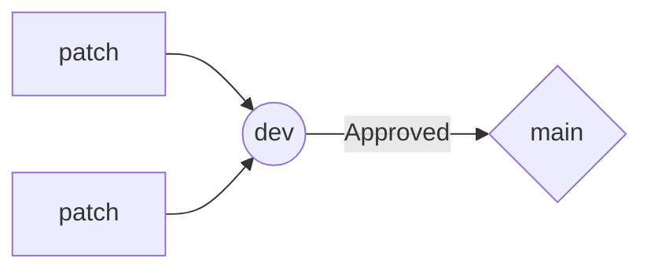

# MoonMelonGames.github.io
MoonMelonGames Website

## Production Process
All work must be done on a branch deriving from the `dev` branch. All merge requests must be performed from `<your-branch>` to `dev` **ONLY**. 
Periodic merges from `dev` will be made. Given enough revisions and after testing to be bug-free, the `dev` branch is merged to `main`, the production branch.

